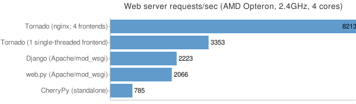

.. Performance

パフォーマンス
==============

.. Web application performance is generally bound by architecture, not 
   frontend performance. That said, Tornado is pretty fast relative to 
   most popular Python web frameworks.

Webアプリケーションのパフォーマンスというのは、フロントエンドの性能ではなく、アーキテクチャでほとんど決まってしまいます。これは、Tornadoは他のPythonのウェブフレームワークと比べて、極めて高速であるということを意味します。

.. We ran a few remedial load tests on a simple "Hello, world" application 
   in each of the most popular Python web frameworks (Django, web.py, and 
   CherryPy) to get the baseline performance of each relative to Tornado. 
   We used Apache/mod_wsgi for Django and web.py and ran CherryPy as a 
   standalone server, which was our impression of how each framework is 
   typically run in production environments. We ran 4 single-threaded 
   Tornado frontends behind an nginx reverse proxy, which is how we recommend 
   running Tornado in production (our load test machine had four cores, and 
   we recommend 1 frontend per core).

私たちは、 "Hello, World"アプリケーションを、Pythonでもっとも人気のあるウェブフレームワーク(`Django <http://www.djangoproject.com/>`_, `web.py <http://webpy.org/>`_, `CherryPy <http://www.cherrypy.org/>`_)でそれぞれ実装し、いくつかの試験的な負荷テストを実行し、Tornadoとの相対的なパフォーマンスの基準値を測定しました。 Djangoとweb.pyにはApache/mod_wsgiを利用し、CherryPyはスタンドアロンサーバとして実行しました。それぞれのフレームワークごとに、私たちが良く本番環境として使用されると予想される環境を設定してあります。 Tornadoは、 `nginx <http://nginx.net/>`_ リバースプロキシを立てて、その後ろに4つのシングルスレッドのTornadoフロントエンドを走らせました。 私たちが推奨する構成としては、1つのコアごとに1つのフロントエンドを走らせて、前にnginxを立てる環境になります。今回の負荷テストでは4コアのマシンを利用しているため、4つとしました。

.. We load tested each with Apache Benchmark (:program:`ab`) on the a separate machine 
   with the command

Apacheベンチマーク(ab)を使用して、コマンドごとにそれぞれ別のマシンを使って負荷テストを行いました。

.. code-block:: bash

  ab -n 100000 -c 25 http://10.0.1.x/

.. The results (requests per second) on a 2.4GHz AMD Opteron processor with 4 cores:

4コアの2.4GHzのOpteronプロセッサを搭載したマシンを使用して、1秒あたりのリクエスト数を計測した結果が以下のグラフになります:

.. In our tests, Tornado consistently had 4X the throughput of the next fastest framework, and even a single standalone Tornado frontend got 33% more throughput even though it only used one of the four cores.

私たちのテストでは、次に高速なフレームワークと比較しても、Tornadoはコンスタントに4倍のスループットを出しています。1コアだけ使用した場合でも33%高速なスループットをたたき出しています。

.. Not very scientific, but at a high level, it should give you a sense that we have cared about performance as we built Tornado, and it shouldn't add too much latency to your apps relative to most Python web development frameworks.

このテストはそれほど科学的ではなく、大ざっぱな視点での話しになりますが、私たちがTornadoを開発するにあたって、パフォーマンスに留意して開発している、という感覚は伝わるはずです。そして、他のほとんどのPython製のウェブ開発のフレームワークと比べて、遅延が大きくなることはないという気になるでしょう。

.. Running Tornado in production

本番環境でTornadoを実行する
============================

.. At FriendFeed, we use nginx as a load balancer and static file server. We run multiple instances of the Tornado web server on multiple frontend machines. We typically run one Tornado frontend per core on the machine (sometimes more depending on utilization).

FriendFeedでは、 `nginx <http://nginx.net/>`_ をロードバランサーおよび静的ファイルのサーバとして使用しています。 FriendFeedでは複数のフロントエンドマシン上で、いくつかのTornadoウェブサーバのインスタンスを起動しています。私たちが通常Tornadoフロントエンドを実行するのは、マシンのコア数と同数にしています。

.. This is a barebones nginx config file that is structurally similar to the one we use at FriendFeed. It assumes nginx and the Tornado servers are running on the same machine, and the four Tornado servers are running on ports 8000 - 8003:

以下のファイルは、FriendFeedで使用されているのと、同じ構造を持つnginxの設定ファイルのひな形です。以下の設定ファイルは、nginxとTornadoサーバが同じマシン上にあり、4つのTornadoサーバが8000〜8003の4つのポートで動作することを想定しています。

.. code-block:: text

  user nginx;
  worker_processes 1;

  error_log /var/log/nginx/error.log;
  pid /var/run/nginx.pid;

  events {
      worker_connections 1024;
      use epoll;
  }

  http {
      # すべてのTornadoサーバはここに列挙します
      upstream frontends {
          server 127.0.0.1:8000;
          server 127.0.0.1:8001;
          server 127.0.0.1:8002;
          server 127.0.0.1:8003;
      }

      include /etc/nginx/mime.types;
      default_type application/octet-stream;

      access_log /var/log/nginx/access.log;

      keepalive_timeout 65;
      proxy_read_timeout 200;
      sendfile on;
      tcp_nopush on;
      tcp_nodelay on;
      gzip on;
      gzip_min_length 1000;
      gzip_proxied any;              
      gzip_types text/plain text/html text/css text/xml
                 application/x-javascript application/xml
                 application/atom+xml text/javascript;

      # コミュニケーションエラーがあったときだけリトライします。
      # Tornadoサーバのタイムアウトではリトライしません。
      # すべてのフロントエンドの"queries of death"が広がるのを避けるための措置です。
      proxy_next_upstream error;

      server {
          listen 80;

          # ファイルのアップロードを許可します
          client_max_body_size 50M;

          location ^~ /static/ {
              root /var/www;
              if ($query_string) {
                  expires max;
              }
          }
          location = /favicon.ico {
              rewrite (.*) /static/favicon.ico;
          }
          location = /robots.txt {
              rewrite (.*) /static/robots.txt;
          }

          location / {
              proxy_pass_header Server;
              proxy_set_header Host $http_host;
              proxy_redirect false;
              proxy_set_header X-Real-IP $remote_addr;
              proxy_set_header X-Scheme $scheme;
              proxy_pass http://frontends;
          }
      }
  }

..    # Only retry if there was a communication error, not a timeout
      # on the Tornado server (to avoid propagating "queries of death"
      # to all frontends)

      # Allow file uploads

.. WSGI and Google AppEngine

WSGIとGoogle AppEngine
=======================

.. Tornado comes with limited support for WSGI. However, since WSGI does 
   not support non-blocking requests, you cannot use any of the 
   asynchronous/non-blocking features of Tornado in your application 
   if you choose to use WSGI instead of Tornado's HTTP server. Some of 
   the features that are not available in WSGI applications: 
   @tornado.web.asynchronous, the httpclient module, and the auth module.

Tornadoは、限定的に `WSGI <http://wsgi.org/>`_ をサポートしています。 しかし、WSGIではノンブロッキングのリクエストをサポートしていないため、TornadoのHTTPサーバではなくWSGIを使用することを選択してしまうと、Tornadoの非同期、ノンブロッキングの機能をアプリケーションで利用することはできなくなります。 :func:`@tornado.web.asynchronous`, :mod:`httpclient` モジュール, :mod:`auth` モジュールといったいくつかの機能は、WSGIアプリケーションでは利用できません。

.. You can create a valid WSGI application from your Tornado request handlers 
   by using WSGIApplication in the wsgi module instead of using 
   tornado.web.Application. Here is an example that uses the built-in 
   WSGI CGIHandler to make a valid Google AppEngine application:

.. Code-block:: python

  import tornado.web
  import tornado.wsgi
  import wsgiref.handlers

  class MainHandler(tornado.web.RequestHandler):
      def get(self):
          self.write("Hello, world")

  if __name__ == "__main__":
      application = tornado.wsgi.WSGIApplication([
          (r"/", MainHandler),
      ])
      wsgiref.handlers.CGIHandler().run(application)

See the appengine example application for a full-featured AppEngine app built on Tornado.

.. Caveats and support

警告とサポート
==============

Tornado was refactored from the FriendFeed code base to reduce dependencies. This refactoring may have introduced bugs. Likewise, because the FriendFeed servers have always run behind nginx, Tornado has not been extensively tested with HTTP/1.1 clients beyond Firefox. Tornado currently does not attempt to handle multi-line headers and some types of malformed input.

You can discuss Tornado and report bugs on the Tornado developer mailing list.
